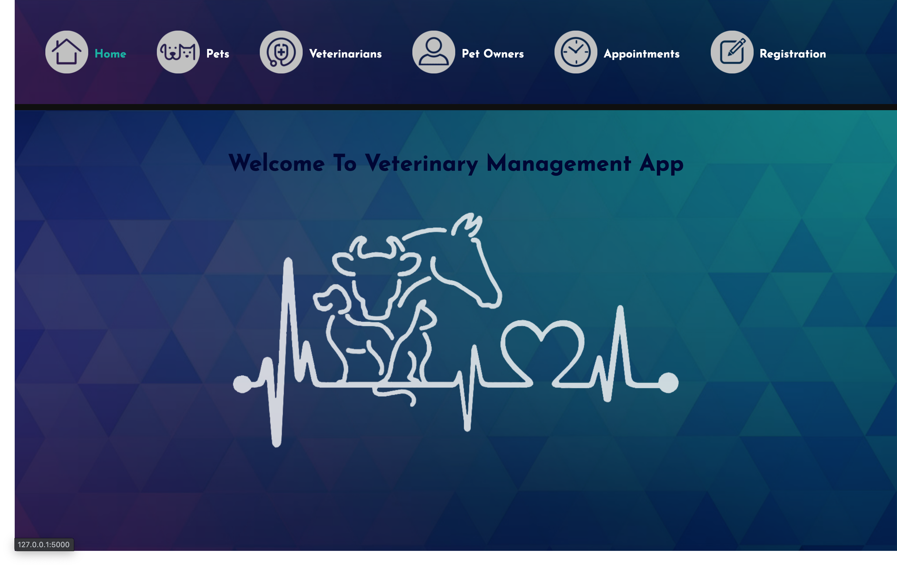

# Veterinary Management App Project

This Veterinary Management Application helps veterinary clinic track pets with their owners as well as veterinarians. CRUD actions are implemented for pets, owners, veterinarians, and appointments. Admin / user can add owners, pets, veterinarians to the system, as well as edit, assign different owners or veterinarians, and delete them. 

This app was built as many to many relationship data model which allowed to achieve more connections between database tables. This means that one pet can be registered to one veterinarian, one veterinarian can look after many pets. One owner can have many pets. One pet can have many appointments as well as one veterinarian can have multiple appointments with the same or a different pet.

### <a href="https://github.com/codeclan/g28_classnotes/blob/main/python_projects/project_briefs/Vet_Management.md">
Full project brief</a>
#


## To use this program run in terminal the fellowing:

```python

# Drop this database in case it is existing
dropdb vet_manager

# Create this database
createdb vet_manager

# Run PostgreSQL
psql -d vet_manager -f db/vet_manager.sql

# Populate with data
python3 console.py 
```


## To query the database:

```python
psql -d vet_manager
```


## This project was created using:
| Python |
| :----- |
| SQL |
| PosgreSQL |
| psycopg2 |
| html |
| css |
| Unit Test |

#
### Home page:
